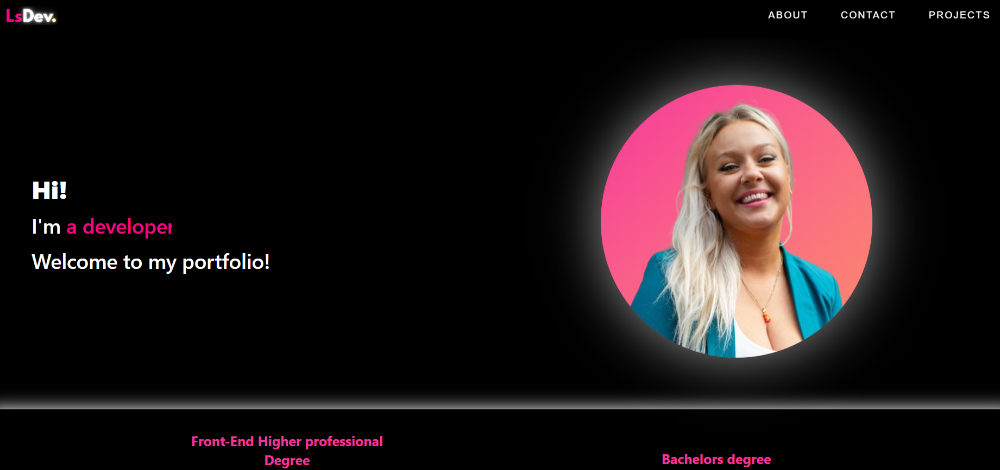

# 💻 My Portfolio Website – Line Svensen

Welcome! This is the codebase for my **personal portfolio website**, built as part of the Noroff Front-end development curriculum.

---

### ✨ Project Overview

This portfolio represents me as a developer – my personality, my tech skills, and some of the projects I've worked on.

I've chosen a **dark theme** with vibrant highlights (especially pink 💖 – my favorite color). Subtle **animations** and smooth transitions help make the experience engaging while still clean and minimal.

---

### 🛠️ Tech & Tools Used

- **VSCode** – Development environment
- **React** – JavaScript UI library
- **React Router DOM** – Routing between pages
- **Zustand** – Lightweight global state management
- **Tailwind CSS** – Utility-first styling
- **Font Awesome / React Icons** – Iconography
- **Vercel** – Deployment platform

---

### 📁 Project Structure

```
src/
├── assets/ # Static images, gifs, logos
├── components/ # Reusable UI components and sections
│ ├── AboutMe.jsx
│ ├── ContactSection.jsx
│ ├── EducationAndSkills.jsx
│ ├── ExperienceSection.jsx
│ ├── Footer.jsx
│ ├── HeroBanner.jsx
│ ├── Navbar.jsx
│ ├── ProjectCard.jsx
│ ├── ProjectsSection.jsx
│ └── SkillsSection.jsx
├── pages/ # Page-level components
│ ├── Home.jsx
│ └── ProjectDetail.jsx
├── store/ # Zustand store for project data
│ └── projectStore.js
├── App.jsx # Route setup and layout
├── main.jsx # App entry point
└── index.css # Tailwind and custom styles
```

---

### 🌟 Features

- 🎯 Mobile-first responsive layout
- 🖼️ Dynamic animated hero section
- 🧩 Modular React components
- 📦 Project cards with individual detail pages
- 🔗 Share button with copy-to-clipboard
- 🌈 Tailwind-driven hover effects & animations
- 🍔 Hamburger menu for mobile nav
- 💬 Contact and About sections
- 🔧 Easily extensible state management via Zustand

---

### 🖼️ Sneak Peek



---

### 📬 Contact

- ✉️ Email: [line.sven@live.no](mailto:line.sven@live.no)
- 💼 [LinkedIn](https://www.linkedin.com/in/line-svensen-967131122/)
- 💻 [GitHub](https://github.com/LineSvensen)

---

### 💬 Reflection

Creating this React-based portfolio was both fun and a valuable learning experience. I challenged myself with animations, responsiveness, clean code structure, and state management using Zustand. I'm proud of the final result and excited to continue evolving it.

---

### 👩‍💻 Built & Designed by

**Line Svensen**
